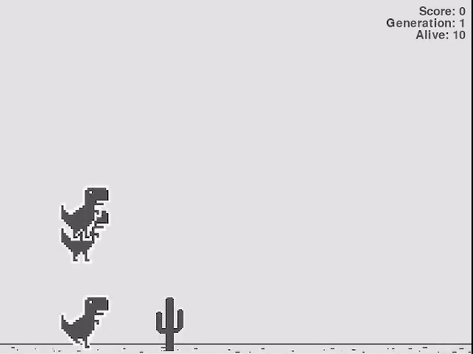

# Dinosaur_Game_using_NEAT

## Introduction
    Reinforcement learning of Google Dinosaur Game using NEAT algorithm.

## Requirements

    1. Pygame Module
    2. NEAT Module

## How it works

Firstly, I made the Google Dinosaur game using PyGame. Then setting the required settings in NEAT
config file. Giving the inputs to each Neurons which are dinosaur y position and the distance from the next obstacle. And the Output given to us is either to jump or not to jump